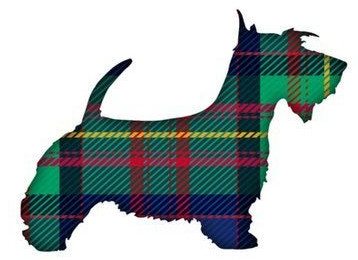
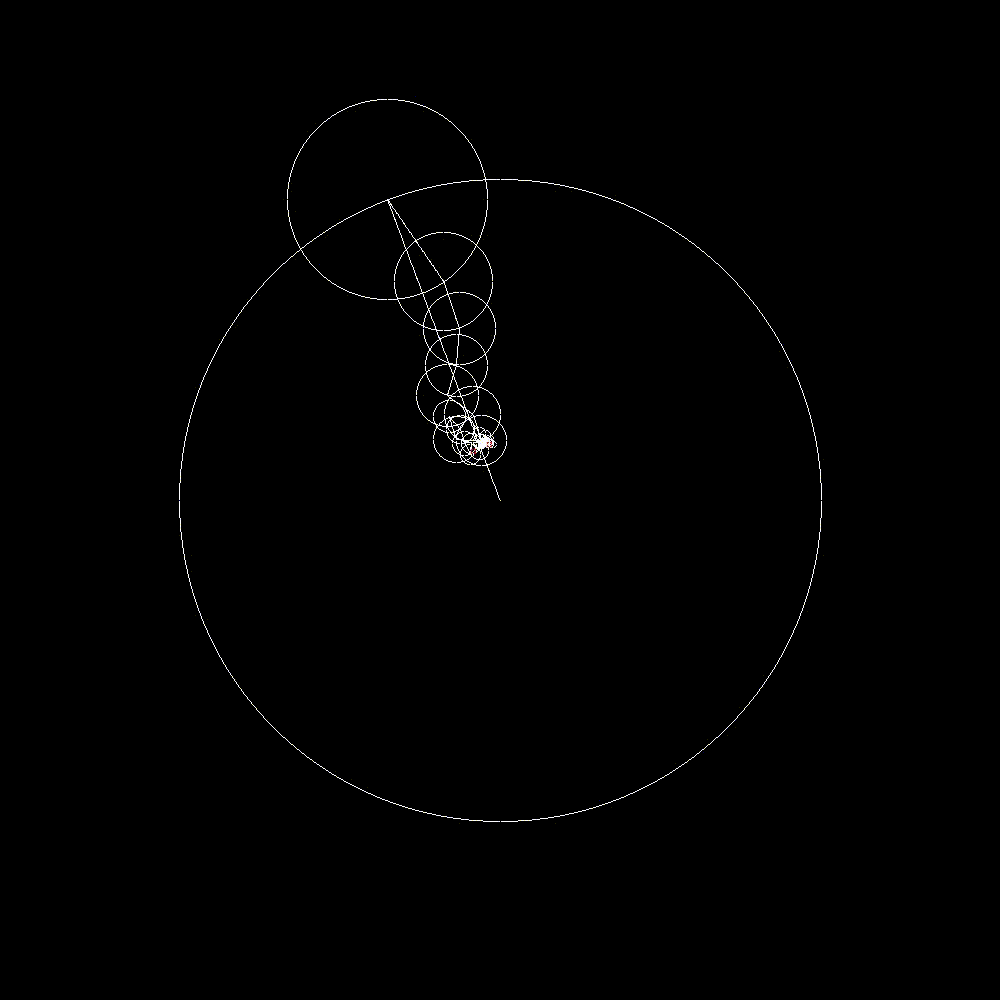
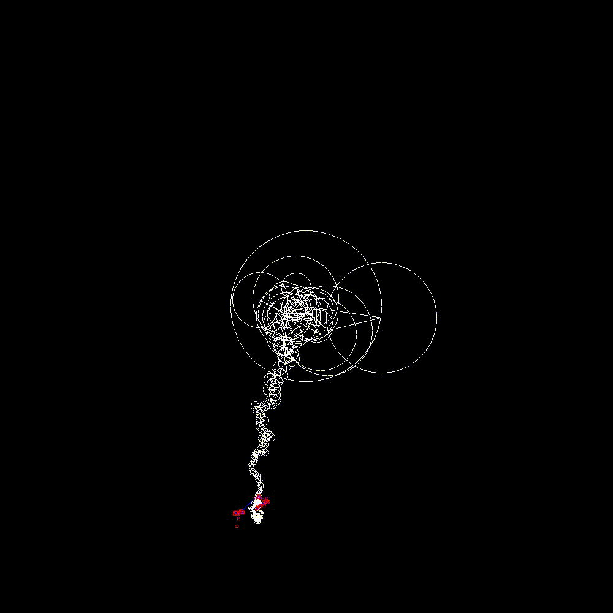

# Fourier Draw
#### (Updated 2021)
### Graphical animation for Fourier Transfor Series Approximations of complex relations


## What is this?
Imagine a moon orbiting around a fixed point at a fixed angular velocity and radius. Now imagine a moon rotating around that moon. And another moon rotating around that one, etc. etc....

Now suppose we placed a pen on the tip of the very last moon of the sequence, what kind of image would it draw?
- By applying a [Complex Fourier Transform Series](https://en.wikipedia.org/wiki/Fourier_series) to the sequence, it is possible to generate the initial angles and velocities of all the *moons* to match arbitrary functions/relations, such as the outline of an image!

## Examples:
(The scotty dog example was traced by hand, and thus has far fewer points than the other examples which were computer generated)
| Original                   | Fourier Animation          |
| -------------------------- | -------------------------- |
|  |  |


(The following examples were computationally generated via edge detection (`cv2.Canny` & `cv2.findContours`) and thus have many more data points. The videos have been sped up to keep the gif size small)
| Original                     | Fourier Animation                |
| ---------------------------- | -------------------------------- |
|  |  |

| Original                  | Fourier Animation             |
| ------------------------- | ----------------------------- |
|  |  |

| Original                | Fourier Animation           |
| ----------------------- | --------------------------- |
|  |  |

## Installation 
### Prerequisites
For the smoothest experience, you'll want the following packages:
- `build-essential` (For building the project, includes `c++11`)
- `clang` (For compilation)
- `ffmpeg` (For creating the movie out of the output images)
- `python3` (For the `PythonAPI`)
- `openmp` (For on the `openmp` branch until it is merged to main)
```bash
sudo apt update
sudo apt install build-essential
sudo apt install clang
sudo apt install ffmpeg
sudo apt install python3, python3-pip

sudo apt install libomp-dev # if you're on the omp branch
```

Then you should just be able to build the project with a simple `make` command

Additionally, for usage of the `PythonAPI` (required for custom images), you'll need the following packages:
- `argparse`
- `numpy`
- `pandas`
- `matplotlib`
- `cv2`

## Usage
The simplest script to run is `FourierDraw.sh` which builds, runs, and animates the project from start-to-finish.

The pipeline is essentially the following
```bash
# rebuild the project
make -B

# generates many image (.ppm) files in /Out
./FourierDraw

# concatenates the images (.ppm) into a movie (.mp4)
./CreateMovie.sh # you can also add a flag to ffmpeg to generate higher quality files
```

If you have any custom tracefiles you'd like to use, move them to the `Data/` directory as a `.csv` with `dataX` and `dataY` as the headers for the pixel points. Look at the existing `.csv`'s as templates. 

## Custom Usage
To use arbitrary images, follow these instructions:
1. Add them to the `Images/` directory as `.png` or `.jpg` files
2. Run `python3 PythonAPI/get_image_traces.py` to generate all the trace-csv's
   1. Optionally, run `python3 PythonAPI/show_image_traces.py` to show the traces plotted
3. Edit the file input and other parameters in `FourierDraw.cpp` to best suit the image
4. Run `./FourierDraw.sh` or each of the steps independently
